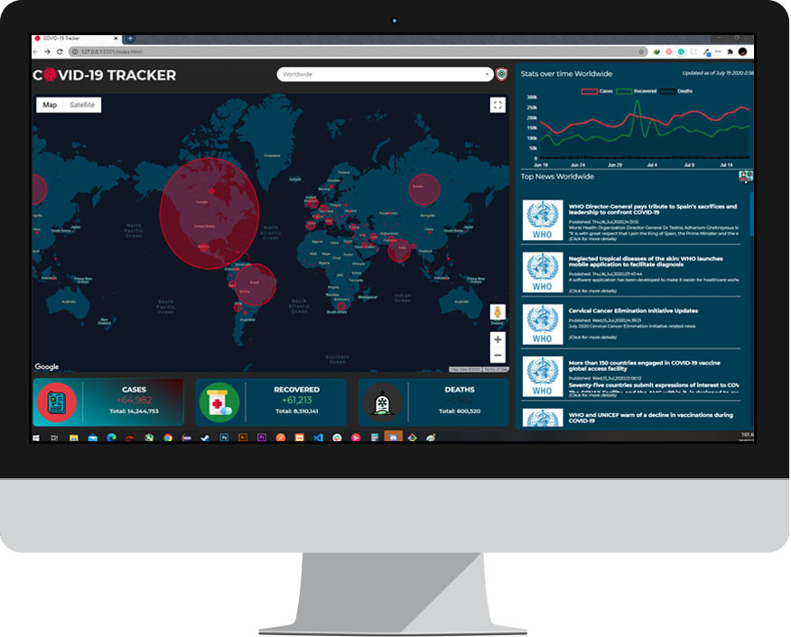

# COVID-19 Tracker (PWJ CONTEST OFFICIAL ENTRY)

COVID-19 Tracker aims to provide comprehensive information with regards to the number of confirmed cases around the world, together with the number of deaths and recoveries, thereof. It features a tracker that monitors the abovementioned data clusters (Cofirmed cases, Deaths, Recoveries).

## Third party application used

API:
_https://disease.sh_  
_https://www.who.int/rss-feeds/news-english.xml_  
_https://api.smartable.ai/_

VIDEO:
_https://www.youtube.com/watch?v=FC4soCjxSOQ&t=3s_

CHANNEL:
_https://www.youtube.com/channel/UCTCEJCypL-cwp2EWlT5pmGg_

## Release History

- 1.0.0
  - Initial Release
